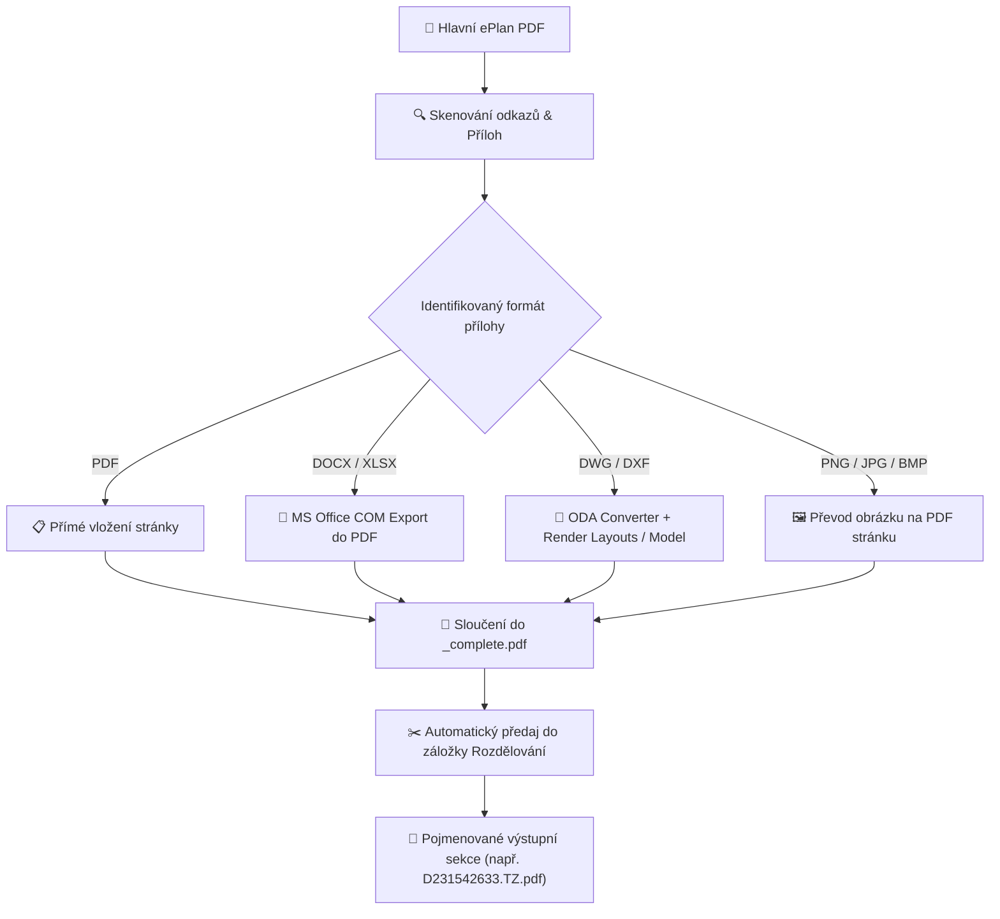
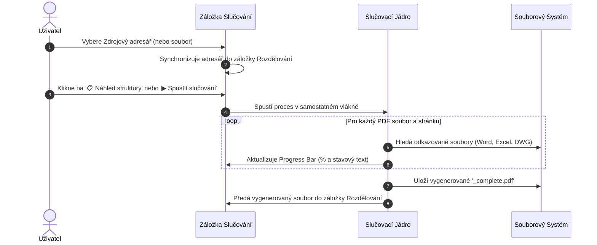

# 📖 Grafický uživatelský manuál
## ePlan Documentation Merger & Splitter

Nástroj pro automatickou kompletaci, slučování externích příloh (DWG, Word, Excel) a rozdělování projektové dokumentace vygenerované ze systému **ePlan**.

---


---

## 💡 Hlavní funkce a možnosti

| Funkce | Popis |
| :--- | :--- |
| 🔍 **Detekce odkazů v PDF** | Skenuje akce typu `Launch` a odkazované přílohy v hlavním ePlan PDF. |
| 📄 **Konverze Word & Excel** | Převádí `.docx`, `.doc`, `.xlsx`, `.xls` do PDF přes nativní COM rozhraní MS Office. |
| 📐 **Konverze DWG / DXF výkresů** | Převádí DWG do DXF (via ODA Converter) a inteligentně renderuje výkresová rozvržení nebo Modelspace. |
| 📊 **Ukazatel postupu v reálném čase** | Plynulý progress bar zobrazuje % a podrobnou stavovou hlášku. |
| 📂 **Rychlé otevření složek** | Tlačítka `📂 Otevřít` u zdrojových a cílových složek v obou záložkách. |
| 🔄 **Oboustranná synchronizace** | Automatické předávání adresářů a výstupního `_complete.pdf` mezi záložkami. |
| ✂️ **Rozdělování dle částí** | Detekuje sekce (`&TZ`, `&SM`, `&VV`, `&BS`, atd.) a exportuje pojmenované PDF dokumenty. |

---

## 🚀 Architektura zpracování (Data Flow)



---

## 🖥️ Uživatelské rozhraní (GUI Overview)


Aplikace je rozdelena do 3 záložek:
1. **🔗 Slučování** – Kompletace hlavního dokumentu s přílohami.
2. **✂️ Rozdělování** – Dělení kompletního PDF na samostatné archivační sekce.
3. **❓ Nápověda** – Uživatelská příručka, návod k instalaci a odkaz na GitHub.

---

## 🔗 Záložka 1: Slučování PDF (PDF Merger)

### Krok za krokem:



> [!TIP]
> Tlačítka **`📂 Otevřít`** vedle polí pro adresáře ihned zobrazí vybrané složky v Průzkumníku Windows.

> [!NOTE]
> Pokud pole **Cílový adresář** ponecháte prázdné, výstupní soubor se automaticky uloží do stejné složky se suffixem `_complete.pdf`.

---

## ✂️ Záložka 2: Rozdělování PDF (PDF Splitter)

### Krok za krokem:

1. **Načtení vstupu**:
   - Po dokončení slučování se vytvořené PDF (např. `D23154_complete.pdf`) automaticky načte do pole **Zdrojový PDF soubor**.
   - Můžete také zvolit libovolné jiné PDF tlačítkem **Procházet...**.

2. **Analýza struktury**:
   - Klikněte na **`🔍 Analýza struktury`**.
   - Program prohledá záložky (TOC) i textové skeny a detekuje sekce podle kódů (`&TZ`, `&SM`, `&VV`, `&BS`, `&TZ1` atd.).

3. **Úprava výstupních názvů & Výběr**:
   - V přehledné tabulce můžete přímo upravovat vygenerované názvy souborů (např. `01_D231542633.TZ.pdf`).
   - Zaškrtnutím/odškrtnutím vyberte pouze požadované části.

4. **Spuštění exportu**:
   - Klikněte na **`▶ Rozdělit PDF dokument`**. Progress bar bude ukazovat stav exportu jednotlivých souborů.
   - Výsledné složky otevřete tlačítkem **`📂 Otevřít cílovou složku`**.

---

## 📄 Přehled konverzí podle formátů příloh

```
[Hlavní ePlan PDF]
 ├── 📄 PDF Příloha ──────> Sloučí přímo
 ├── 📝 MS Word (.docx) ──> Otevře přes COM -> Export do PDF -> Sloučí
 ├── 📊 MS Excel (.xlsx) ─> Otevře přes COM -> Export do PDF -> Sloučí
 ├── 📐 AutoCAD (.dwg) ───> ODA Converter -> DXF -> Render Layouts/Model -> Sloučí
 └── 🖼️ Obrázek (.png) ───> Převede na PDF stránku -> Sloučí
```

---

## 🛠️ Požadavky a Řešení Problémů

> [!IMPORTANT]
> Pro správnou konverzi dokumentů Office musíte mít na počítači nainstalovaný MS Word a MS Excel. Převod DWG funguje samostatně bez AutoCADu díky přibalenému ODA File Converteru.

> [!WARNING]
> Pokud systém Windows při spuštění portable `.exe` zobrazí varování SmartScreen, klikněte na **Více informací** $\rightarrow$ **Spustit i přesto**.

---

## 🌐 Zdrojový Kód a Repozitář

Zdrojový kód, aktualizace a vývojový repozitář naleznete na GitHubu:
* **GitHub Repository:** [Jamilb13/ePlan-complete](https://github.com/Jamilb13/ePlan-complete)
* **Portable Spustitelný Soubor:** [ePlan_Documentation_Merger.exe](file:///c:/Users/behalek/OneDrive%20-%20AUTEL,%20a.s/99_Osobn%C3%AD/01_Projects/Antigravity/ePlan%20complete/dist/ePlan_Documentation_Merger.exe)
